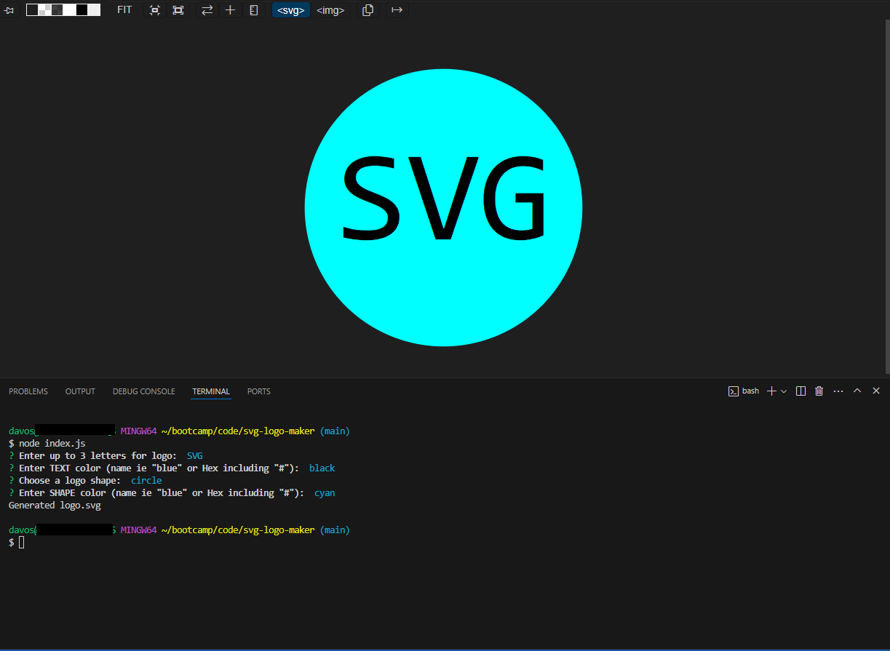

  # SVG Logo Maker

  

  ## Description

  This is an SVG generator that allows users to create a simple SVG logo

  ## Table of Contents

  - [Installation](#installation)
  - [Usage](#usage)
  - [Credits](#credits)
  - [License](#license)

  ## Installation

  To use this application, familiarity with code or a similar program is required, along with Node.js. After downloading or cloning the repository, navigate to the directory in your terminal and enter

  `npm install`

  followed by

  `node index.js`

  then follow the prompts in your terminal to generate an SVG

  ## Usage

  [Link to Demo](https://drive.google.com/file/d/1yFaqPFVd-dkTBw5w57IK01FOVI2Ls275/view?usp=sharing)
  
  After using the method described above to begin using the application, follow the prompts to generate yuor own SVG logo. You can find the generated logo in the "examples" folder of the repository

  
  
  ## Credits 

  My wife for putting up with me while I continue my journey in full stack web development

  ## License

  Unlicense 

  Click the badge for further information

  

  ## Questions
  
  For any further questions, please contact davesalter1988@gmail.com, and visit https://github.com/DaveSalterM for additional projects